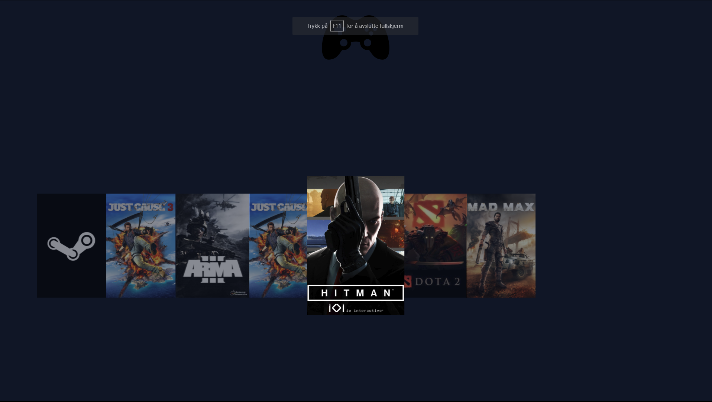

<h2>Moonlight app</h2>

Creates a web server Using <a href="https://github.com/irtimmer/moonlight-embedded">Moonlight-Embedded<a/> with a list of games that can be started from the browser or mobile.

You must pair the computers

<h3>Usage:</h3>
<ul>
<li>Have <a href="https://github.com/irtimmer/moonlight-embedded">Moonlight-Embedded<a/> Installed</li>
<li>install with: <code>npm i</code> </li>
<li>development (requires nodemonjs)</li>
<li><code>npm run dev</code></li>
<li>To run:</li>
<li><code>npm start</code></li>
</ul>

